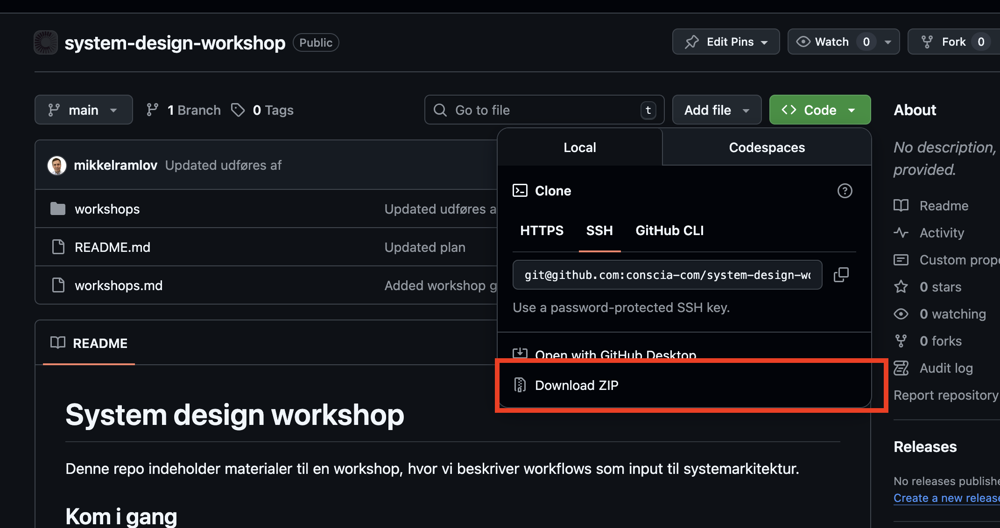

# 🎯 System Design Workshop

Denne repo indeholder materialer til en workshop, hvor vi beskriver workflows som input til systemarkitektur.

---

## 🚀 Kom i gang

1. **Åbn workshop-planen:** [workshop-1.md](workshops/workshop-1.md)
2. **Brug skabelonen:** [workflow-skema.md](workshops/skabeloner/workflow-skema.md)
3. **Se eksempler på udfyldte workflows:**
   - [VLAN provisionering](workshops/eksempler/workflow-eksempel-1-vlan-provisionering.md)
   - [Firewall regel](workshops/eksempler/workflow-eksempel-2-firewall-regel.md)

---

## 📋 Sådan kører vi Workshop 1

**Workflowet i dagen:**

1. Alle skriver workflows ind i Teams Planner som opgaver, hver for sig
2. Vi deler os i makkerpar
3. Hvert par tager et workflow ad gangen og udfylder workflow-skemaet
4. Til sidst samler vi en kort liste over systemer og integrationer der går igen

---

## 🤖 Brug AI til at lave workflows

### Trin 1: Download materialer

Download eksempler og skabelon:  



### Trin 2: Forbered filerne

Unzip pakken

### Trin 3: Upload til Copilot

Åbn Copilot og træk eksempler og skabelon ind i chatten:

- [workflow-eksempel-1-vlan-provisionering.md](workshops/eksempler/workflow-eksempel-1-vlan-provisionering.md)
- [workflow-eksempel-2-firewall-regel.md](workshops/eksempler/workflow-eksempel-2-firewall-regel.md)
- [workflow-skema.md](workshops/skabeloner/workflow-skema.md)

### Trin 4: Prompt Copilot

Skriv en prompt ala:

```
Udfyld workflow skema med indholdet: ...
```

### Trin 5: Eksporter resultatet

Når I er færdig med at rette i indholdet med Copilot, så prompt:

```
Output som en markdown md fil
```

### Trin 6: Gem og tilpas

1. Download markdown filen
2. Ret indholdet til

### Trin 7: Tilføj til Teams Planner

1. Gå ind i Teams Planner og vælg **"Tilføj opgave"** med workflow overskrift
2. Åbn opgaven og kopier md-fil indholdet ind i noter feltet

---

## 📂 Struktur

| Type | Sti |
|------|-----|
| 📖 Workshop-plan | [workshops/workshop-1.md](workshops/workshop-1.md) |
| 📝 Skabelon | [workshops/skabeloner/workflow-skema.md](workshops/skabeloner/workflow-skema.md) |
| 💡 Eksempler | [workshops/eksempler](workshops/eksempler) |

---

## 📌 Noter

- Materialet er skrevet i Markdown.
- Vi holder skabelonerne korte og copy paste venlige.
